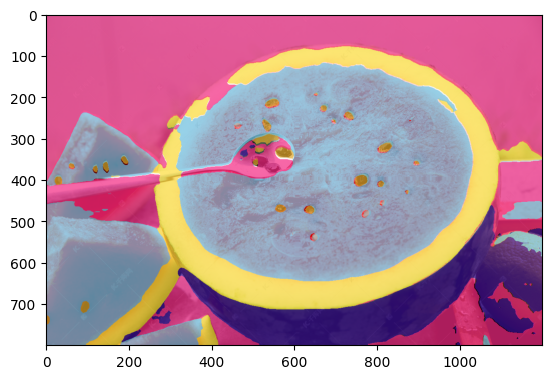

# 第四次作业：MMSeg 语义分割

```bash
# 训练
mim train mmseg configs/pspnet_r50-d8_final.py

# 测试
mim test mmseg configs/pspnet_r50-d8_final.py --checkpoint work_dirs/pspnet_r50-d8/iter_3000.pth

# 测试结果
# aAcc: 86.8200  mIoU: 72.0300  mAcc: 88.4200
```

## 推理

原图


推理结果


