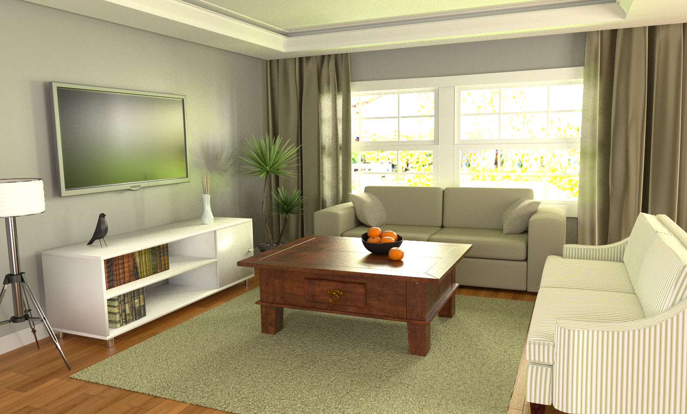
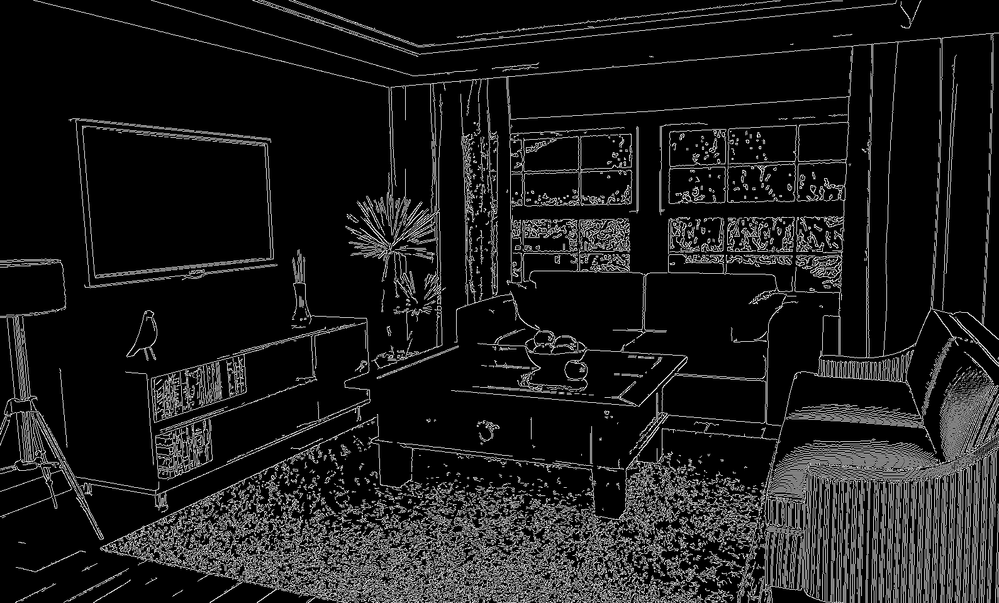
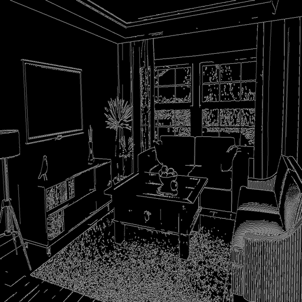
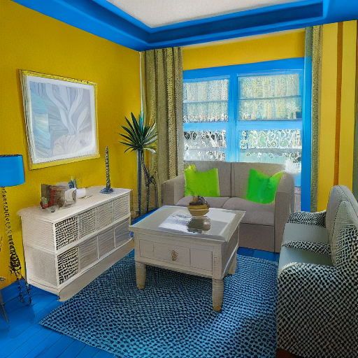

# 第五次作业：ControlNet 的 N 种玩法

## 毛坯房图



## Canny 边缘检测图



## 咒语 Prompt

```python
prompt = 'Room with blue walls and a yellow ceiling.'
```

## ControlNet 生成图

`control_0.png`



`sample_0.png`


